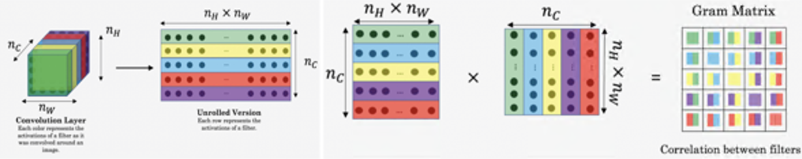
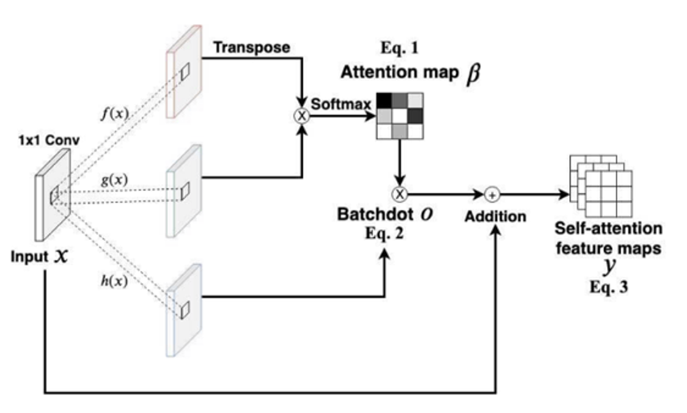

# Fake-Face-Detection

This project is a texture-based synthetic face detection. 
By combining the gram matrix that extracts the global texture and the self-attention that extracts the local texture, 
it finds the correlation of the synthetic face image and detects the synthetic face image through it.

# Method 

+ Network Architecture 
  
  
  
  The network structure is a combination of a gram block and a self-attention block as above.
  
+ Gram Block
  
  Each element value of the Gram matrix means the correlation value between the feature maps that match each row and column.

  

  - Transform the matrix through vectorize.
  - Calculate the correlation matrix through the dot product.
  - Divide the resulted value by the total number of matrices and perform nomalization to obtain the Gram matrix.
  

+ Self-Attention Block

  Each element value of the Self-Attention matrix means the correlation value between the pixels that match each row and column.

  

  - First, Query, Key, and Value are created from the input image through three convolution layers. 
  - Calculate the dot product of Query and Key of the input image calculated above to create an attention score.
  - Calculate the softmax value of the attention score.
  - Value is multiplied by the above attention score and a feature map consisting of weighted values in the same form as the input image is presented as a result.
  - Finally, self-attention feature maps are derived by adding the created map to the input image.
  
# How to use

+ Prepare Dataset

  1. Download & Create dataset

      The dataset consists of two types, real image and fake image.
    
      The real image was used for the following Gan learning. 

      - [FFHQ](https://github.com/NVlabs/ffhq-dataset) 

      - [CelebA-HQ](https://github.com/switchablenorms/CelebAMask-HQ).

      The fake image was created using the following GAN.

      - [StarGAN](https://github.com/yunjey/stargan)

      - [PGGAN](https://github.com/tkarras/progressive_growing_of_gans)

      - [StyleGAN](https://github.com/NVlabs/stylegan)

      - [StyleGAN2](https://github.com/NVlabs/stylegan2)

  2. Create txt with image path
        Before implement the code, modify the root that is the image path and the output that is the output in the code.
        ```
        python dir2txt.py
        ```
        
+ Train
  
  After modifying each value in config.py, run the following command to learn.
  
  ```
  python train.py
  ```
  
+ Test
  
  To test the learned best model, run the following command to learn.
  
  ```
  python test.py
  ```

# Results


# TO DO

+ modify code
+ change Nework Architecture based on [Self-Attention GAN](https://arxiv.org/pdf/1805.08318.pdf)

# Reference 

Hyeonseong Jeon and Youngoh Bang and Simon S. Woo(2020), FDFtNet: Facing Off Fake Images using Fake Detection Fine-tuning Network 

[paper](https://arxiv.org/pdf/2001.01265.pdf)       [code](https://github.com/cutz-j/FDFtNet)

Zhengzhe Liu and Xiaojuan Qi and Philip Torr(2020), Global Texture Enhancement for Fake Face Detection in the Wild 

[paper](https://arxiv.org/pdf/2002.00133.pdf)
